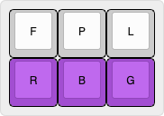
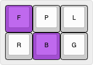
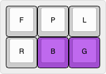

# Emily's Symbol Dictionary 

## Design 

This dictionary was created with the following goals in mind:
- Have a consistent method to type (pretty much) every symbol 
- Specify spacing and capitalisation of that symbol in 1 stroke 
- Hackable and understandable to anyone who finds it useful :)

## Sections 

To support the design goals, for each symbol there are 6 different options specifiable in sections of each stroke:

1. Unique Starter (Red)
2. Spacing/Attachment (Orange)
3. Capitalisation (Teal)
4. Variant (Green)
5. Symbol (Purple)
6. Repetition (Blue)

These options are mapped to different sections of the steno board:

### Unique Starter
The first part of the stroke is always the same and identifies all the symbols.
In the Magnum Steno dictionary that I use, `SKHW` is a unique key combination for the left hand that is never used.
(note that `SKWHR` is used, but by not using `-R`, this makes it unique)

Due to this, all the combinations of remaining strokes will have no clashes and are free to be used to specify everything needed. 
To adjust this starter to your dictionary just change the "uniqueStarter" variable at the top of the dictionary!

### Attachment 
There is a consistent way to specify attachment to the text around a symbol using the `A` and `O` keys.
By default with no attachment specified spaces are inserted on both side of a symbol, like the `&` in the following example: `one & two`.

| Keys                                            | Output               |
|-------------------------------------------------|----------------------|
|  | `x . x`, `one & two` |

When the `A` key is used, no space is inserted before the symbol is typed, moving it to the left of normal, like the `:` in this example: `example: one`.
| Keys                                                | Output                 |
|-----------------------------------------------------|------------------------|
|  | `x. x`, `example: one` |

Similarly, when the `O` key is used, no space is inserted after the symbol, moving it to the right of normal, like the `"` in this example: `said "To`.
| Keys                                                  | Output             |
|-------------------------------------------------------|--------------------|
|  | `x .x`, `said "To` |

When both combined, no spaces are used at all like the `.` in this example: `3.6`.
| Keys                                                | Output       |
|-----------------------------------------------------|--------------|
|  | `x.x`, `3.6` |

### Capitalisation 

The `*` can be used to specify capitalisation of the text following the symbol. 

By default no capitalisation is applied.
| Key                                     | Output     |
|-----------------------------------------|------------|
|  | `x . x`, `(cons` |

With the `*` key used, the next input is capitalised.
| Key                                     | Output              |
|-----------------------------------------|---------------------|
|  | `x . X`, `said "To` |

### Variant

There are a lot of similar symbols, to manage this, each symbol has a base symbol and a list of variant symbols. 
The specific variant required is chosen with a combination of the `E` and `U` keys, this allows for 4 total variants of a symbol.

By default the base symbol is typed, this is generally the most common of all the variants.
| Key                                     | Output   |
|-----------------------------------------|----------|
|  | `(`, `$` |

When the `E` key is used, the left (or first) variant is typed instead.
| Key                                     | Output   |
|-----------------------------------------|----------|
|  | `[`, `¥` |

When the 'U' key is used, the right (or second) variant is typed.
| Key                                     | Output   |
|-----------------------------------------|----------|
|  | `<`, `€` |

When both `E` and `U` are used, the final variant is typed.
| Key                                     | Output   |
|-----------------------------------------|----------|
|  | `{`, `£` |

These variants are stored in the main symbols dictionary and you should edit them based on which ones are more frequent for you!
Though I hope my defaults are good enough.

### Symbol 

The main section is the symbol section, used to specify the specific symbol to type.
Only a 2x3 grid is needed to address all the symbols, using variants.
All of the patterns for symbols are done according to shape, rather than phonetics or briefs, and so should be remember visually with the images as an aid.
For each symbol shape the pattern only addresses the base symbol, it doesn't apply as well to the variant symbols. As such, the variants should be anchored in memory to the base symbol itself rather than the pattern. 

| Pattern                                       | Symbols                                                            | Description                                                                 |
|-----------------------------------------------|--------------------------------------------------------------------|-----------------------------------------------------------------------------|
| Whitespace                                    |                                                                    |                                                                             |
|      | `{#Tab}, {#Backspace}, {#Delete}, {#Escape}`             | The pattern aligns with the tips of the arrows on a tab key legend: ↹       |
| Arrows                                        |                                                                    |                                                                             |
|                | `{#Up}, {#Left}, {#Right}, {#Down}`                      | Looks like an arrow key cluster                                             |
| Navigation                                    |                                                                    |                                                                             |
|             | `{#Page_Up}, {#Home}, {#End}, {#Page_Down}`              | Arrow key cluster but with an addition key held down                        |
| Music                                         |                                                                    |                                                                             |
|                | `{#AudioPlay}, {#AudioPrev}, {#AudioNext}, {#AudioMute}` | Like a strangely rotated L for err... _L_ovely music?                     |
| Blank                                         |                                                                    |                                                                             |
|                | `, {*!}, {*?}, {#Space}`                                 | It's blank! Self descriptive                                                |
| !                                           |                                                                    |                                                                             |
|    | `!, ¡, ¡, ¬`                                             | Vertical shape that's off to the left, like `!` on a regular keyboard        |
| "                                            |                                                                    |                                                                             |
|  | `\", “, ”, „`                                            | Two dots up high like it's shape, and off to the left like on ISO keyboards |
| \#                                          |                                                                    |                                                                             |
|                  | `#, ©, ®, ™`                                             | Two vertical bars like in the shape                                         |
| $                                           |                                                                    |                                                                             |
|              | `$, ¥, €, £`                                             | Makes an `S` shape like a `$`                                               |
| %                                           |                                                                    |                                                                             |
|            | `%, ‰, ‰, ‰`                                             | Same as a `/` but with the two extra keys representing the dots             |
| &                                           |                                                                    |                                                                             |
|        | `&`                                                              | Makes a mirror image of the standard 'and' brief (mirrored for ease)        |
| '                                           |                                                                    |                                                                             |
|                | `', ‘, ’, ‚`                                             | One dot up high, similar to `"`, on the index for importance                |
| (                                           |                                                                    |                                                                             |
|                  | `(, [, <, {`                                            | Similar to the standard steno brief                                         |
| )                                           |                                                                    |                                                                             |
|                | `), ], >, }`                                            | Similar to the standard steno brief                                         |
| *                                           |                                                                    |                                                                             |
|                  | `*, ×, ×, ×`                                             | single dot shape, off to the right like JIS, up high in the sky             |
| +                                           |                                                                    |                                                                             |
|                | `+, §, ¶, ±`                                             | single dot shape, off to the right like JIS, under the star                 |
| ,                                           |                                                                    |                                                                             |
|                | `,`                                                              | Single dot shape, below like on a keyboard, middle finger as less important |
| -                                           |                                                                    |                                                                             |
|                  | `-, –, —, —`                                             | Line in shape, up in the top right like a normal keyboard                   |
| .                                           |                                                                    |                                                                             |
|                    | `., •, •, …`                                             | Single dot in shape, below like on a keyboard, index finger as important    |
| /                                           |                                                                    |                                                                             |
|                | `/, ÷, ÷, ÷`                                             | Shape of a `/`                                                              |
| :                                           |                                                                    |                                                                             |
|                | `:`                                                              | Vertical shape, off to the right like a normal keyboard                     |
| ;                                           |                                                                    |                                                                             |
|        | `;`                                                              | Literally a `,` and `.` at the same time                                    |
| =                                           |                                                                    |                                                                             |
|              | `-`                                                              | Literally a `-` and a `_` at the same time                                  |
| ?                                           |                                                                    |                                                                             |
|          | `?, ¿, ¿, ¿`                                             | Looks like the top of a `?`                                                 |
| @                                           |                                                                    |                                                                             |
|                      | `@`                                                              | Large complicated shape, only way to make a big spiral                      |
| \\                                          |                                                                    |                                                                             |
|        | `\`                                                             | Shape of a `\`                                                             |
| ^                                           |                                                                    |                                                                             |
|                | `^, «, », °`                                             | Shape of a `^` and other pointy/raised symbols                              |
| \_                                          |                                                                    |                                                                             |
|      | `_, µ, µ, µ`                                             | A line down low opposing `-`, and other lowered symbols                     |
| \`                                          |                                                                    |                                                                             |
|          | ` \` `                                                             | Single dot up high, next to `'`                                             |
| \|                                          |                                                                    |                                                                             |
|                  | `\|, ¦, ¦, ¦`                                             | Nice symetrical vertical shape goes in the middle                                  |
| \~                                          |                                                                    |                                                                             |
|                | `~, ˜, ˜, ˜`                                             | Makes the shape of a `~`                      |

### Repetition 

You may want to duplicate certain symbols, such as logical OR `||` or org-mode headings `### Title`.
Repetition is done with the `-T` and `-S` keys.

By default any symbol is typed out once.
| Key                         | Output |
|-----------------------------|--------|
|  | `:`    |

When using the `-S` key, the symbol is typed twice in a row. 
Think of 's' pluralising words.
| Key                         | Output |
|-----------------------------|--------|
|  | `::`   |

When using the `-T` key, the symbol is typed out three times in a row.
Think _T_riple. 
| Key                             | Output |
|---------------------------------|--------|
|  | `:::`  |

When using both `-S` and `-T` the symbol is typed out a combined 4 times.
| Key                           | Output |
|-------------------------------|--------|
|  | `::::` |
